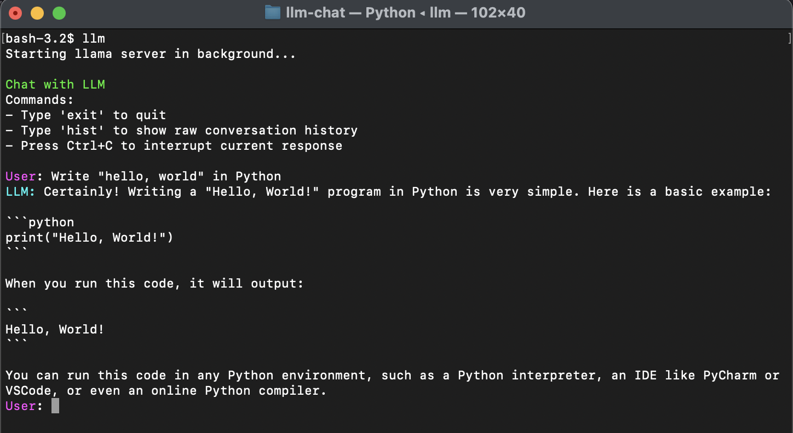

# llm-chat - Interactive Chat with LLM

## Overview
llm-chat is a Python-based interactive command-line utility that communicates with a language model using streaming responses. The chat maintains conversation history, allows interruption, and provides basic command functionality.



## Features
- Interactive chat with LLMs via OpenAI-compatible API
- Primary focus has been on using with a locally-hosted model
- Starts llama-server in background if invoked via `llm` shell script
- Streaming responses for a smooth user experience
- Graceful handling of user interruptions (Ctrl+C)
- View raw conversation history
- Environment variable-based configuration

## Installation & Setup
### Prerequisites
Ensure you have Python installed on your system. You also need the following dependencies:

- `openai`
- `python-dotenv`

### Installation
1. Clone this repository or copy the script into a directory:
   ```sh
   git clone <repository-url>
   cd <repository>
   ```
2. Install the required dependencies:
   ```sh
   python -m venv .venv
   source .venv/bin/activate
   pip install -r requirements.txt
   ```
3. Set up the environment variables by creating a `.env` file in the project directory with:
   ```sh
   OPENAI_API_KEY=your-api-key-here
   OPENAI_BASE_URL=http://localhost:8080/v1
   ```

## Usage
Run the llm shell script:
```sh
llm
```
The script will launch llama-server in background and then will launch the chat client.

Alternatively launch llm.py directly, if you have an OpenAI compatible endpoint available (e.g. llama-server is already running):
```sh
source .venv/bin/activate
python llm.py
```

### Commands
- **Type your message** to interact with the chatbot.
- **`hist`** – Display the raw conversation history in JSON format.
- **`exit`** – Quit the chatbot gracefully.
- **`Ctrl+C`** – Interrupt the chatbot mid-response and return to the prompt.

## How It Works
1. The script initializes by loading environment variables.
2. The `ChatClient` class manages the conversation loop and API interaction.
3. User messages are stored in `self.messages` and passed to the OpenAI API.
4. Responses are streamed and printed in real-time.
5. The chatbot supports user interruptions and displays conversation history on demand.

## License
This project is licensed under the MIT License.

## Contributing
Feel free to submit issues or pull requests to improve functionality and usability.
